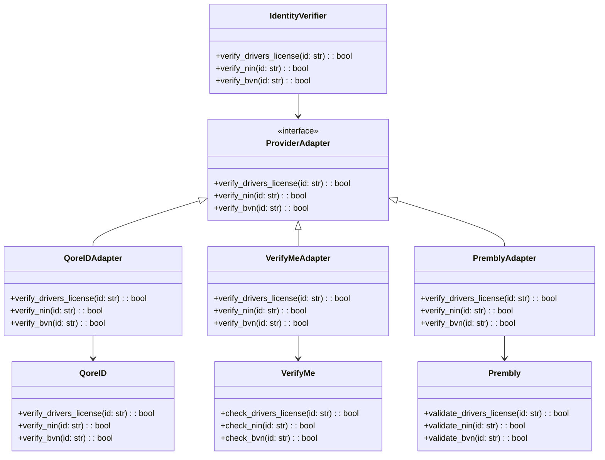

```mermaid
classDiagram
    direction TD

    class IdentityVerifier {
        +verify_drivers_license(id: str) : bool
        +verify_nin(id: str) : bool
        +verify_bvn(id: str) : bool
    }

    class ProviderAdapter {
        <<interface>>
        +verify_drivers_license(id: str) : bool
        +verify_nin(id: str) : bool
        +verify_bvn(id: str) : bool
    }

    class QoreID {
        +verify_drivers_license(id: str) : bool
        +verify_nin(id: str) : bool
        +verify_bvn(id: str) : bool
    }

    class VerifyMe {
        +check_drivers_license(id: str) : bool
        +check_nin(id: str) : bool
        +check_bvn(id: str) : bool
    }

    class Prembly {
        +validate_drivers_license(id: str) : bool
        +validate_nin(id: str) : bool
        +validate_bvn(id: str) : bool
    }

    class QoreIDAdapter {
        +verify_drivers_license(id: str) : bool
        +verify_nin(id: str) : bool
        +verify_bvn(id: str) : bool
    }

    class VerifyMeAdapter {
        +verify_drivers_license(id: str) : bool
        +verify_nin(id: str) : bool
        +verify_bvn(id: str) : bool
    }

    class PremblyAdapter {
        +verify_drivers_license(id: str) : bool
        +verify_nin(id: str) : bool
        +verify_bvn(id: str) : bool
    }

    IdentityVerifier --> ProviderAdapter
    ProviderAdapter <|-- QoreIDAdapter
    ProviderAdapter <|-- VerifyMeAdapter
    ProviderAdapter <|-- PremblyAdapter

    QoreIDAdapter --> QoreID
    VerifyMeAdapter --> VerifyMe
    PremblyAdapter --> Prembly

```
