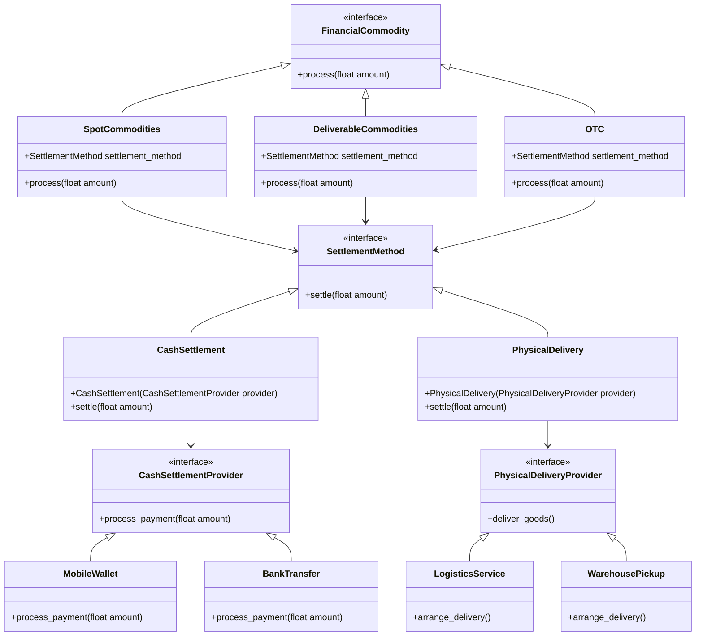

```mermaid
classDiagram
    direction TB

    class FinancialCommodity {
        <<interface>>
        +process(float amount)
    }

    class SpotCommodities {
        +SettlementMethod settlement_method
        +process(float amount)
    }

    class DeliverableCommodities {
        +SettlementMethod settlement_method
        +process(float amount)
    }

    class OTC {
        +SettlementMethod settlement_method
        +process(float amount)
    }

    class SettlementMethod {
        <<interface>>
        +settle(float amount)
    }

    class CashSettlement {
        +CashSettlement(CashSettlementProvider provider)
        +settle(float amount)
    }

    class PhysicalDelivery {
        +PhysicalDelivery(PhysicalDeliveryProvider provider)
        +settle(float amount)
    }

    class CashSettlementProvider {
        <<interface>>
        +process_payment(float amount)
    }

    class MobileWallet {
        +process_payment(float amount)
    }

    class BankTransfer {
        +process_payment(float amount)
    }

    class PhysicalDeliveryProvider {
        <<interface>>
        +deliver_goods()
    }

    class LogisticsService {
        +arrange_delivery()
    }

    class WarehousePickup {
        +arrange_delivery()
    }

    FinancialCommodity <|-- SpotCommodities
    FinancialCommodity <|-- DeliverableCommodities
    FinancialCommodity <|-- OTC

    SettlementMethod <|-- CashSettlement
    SettlementMethod <|-- PhysicalDelivery

    CashSettlementProvider <|-- MobileWallet
    CashSettlementProvider <|-- BankTransfer

    PhysicalDeliveryProvider <|-- LogisticsService
    PhysicalDeliveryProvider <|-- WarehousePickup

    SpotCommodities --> SettlementMethod
    DeliverableCommodities --> SettlementMethod
    OTC --> SettlementMethod

    CashSettlement --> CashSettlementProvider
    PhysicalDelivery --> PhysicalDeliveryProvider

```